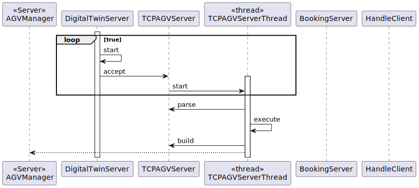
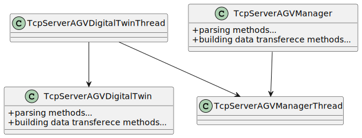

# US1005
=======================================

# 1. Requisitos

**As Project Manager, I want that the team start developing the input communication module of the AGV digital twin to accept requests from the "AGVManager".**

Sockets serão utilizados

# 2. Análise

O AGV digital twin irá ter um "server" e "client" de acordo com o SPOMSP.

**Dependência(s)**

Não existem para esta US. Embora as US 5002,4001 e 4002 tenham que ter um protocolo de comunicação estabelecido. 

**Fluxo Básico**

1. O client é ligado.

- 2. Data é transferida para o AGVManager que é um server.

- 3. O AGVManager responde.

**Esclarecimento(s) do Cliente**

**1.** Category constitution

"For all of those US, the communication between the two involved components must be implemented in accordance with the SPOMS2022. The requests processing can be somehow mocked. For instance, if processing a request implies saving some data to the database, the component can instead write such data to a log (mocking). Latter, on next sprint, the teams implement the interaction to the database.

However, it is not advisable mocking everything, namely the components (internal) state. Notice that by mocking you are letting extra effort to the next sprint.

Finally, all US must be demonstrable."

## 2.1 Futuras implementações para os outros atores

* Não existem.

## 2.2 Sequência das ações

* O AGV Digital Twin será ligado ao server do AGV M

## 2.3 Regras de negócio associadas aos atributos de uma category.

* Respeitar as regras do SPOMSP

## 2.4 Pré Condições

* n/a.

## 2.5 Pós Condições

* As requests são atendidas.

## 2.6 SSD

* Não há SSD pois ,en principio não é suposto haver interação com o utilizador.
# 3. Design

## 3.1. Realização da Funcionalidade

## 3.2. Diagrama de Classes

## 3.3. Protoco de Comunicação

* A data transferida está de acordo com o SPOMSP.

## 3.4. Testing

**Teste(s) 1:** Verificar que o Packet fica formatado de acordo com o SPOMSP.

    @Test
    void ensurePacketisWellFormatted() {
        Packet packet = new Packet((byte) 0,(byte) 1,"data".getBytes(StandardCharsets.UTF_8));
       assertEquals(packet.getCode(),1);
       assertEquals("data",packet.data());
    }

# 4. Implementação

   
}

# 5. Integração/Demonstração

    ...
# 6. Observações

    ...