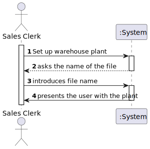
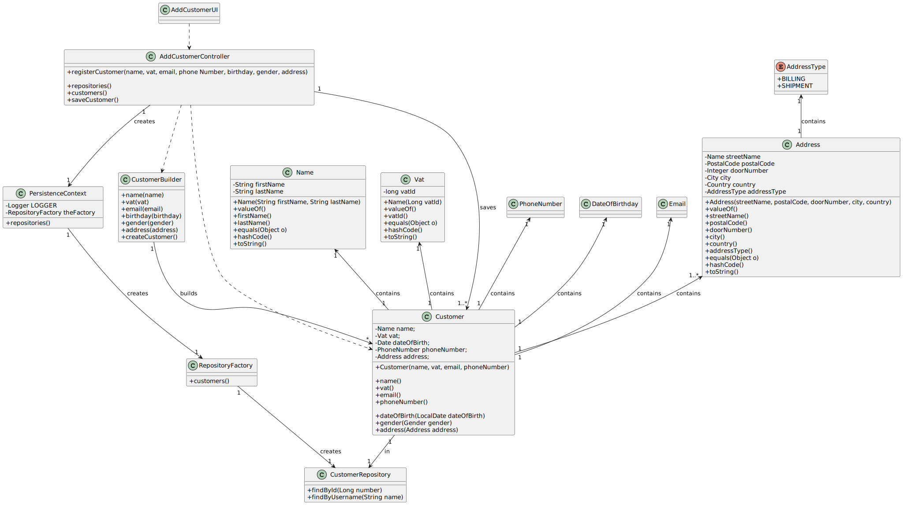

# US1003
=======================================

# 1. Requisitos

**US2003** As Warehouse Employee, I want to set up the warehouse plant by uploading a JSON file.

A interpretação feita deste requisito foi no sentido de importar a planta de um armazém no sistema, através do uso de JSON.

# 2. Análise

## 2.1 Futuras implementações para os outros atores

## 2.2 Sequência das ações

* O sistema irá perguntar o nome do ficheiro a introduzir. Apenas será necessário o nome do ficheiro, já que estes serão
guardados num diretório pré-definido (warehouses).

## 2.4 Pré Condições

n/a.

## 2.4 Pós Condições

A informação dos warehouses é persistida.

## 2.6 SSD

# 3. Design

## 3.1. Realização da Funcionalidade

## 3.2. Diagrama de Classes

## 3.3. Padrões Aplicados

## 3.4. Testes 
*Nesta secção deve sistematizar como os testes foram concebidos para permitir uma correta aferição da satisfação dos requisitos.*

# 4. Implementação

# 5. Integração/Demonstração

*Nesta secção a equipa deve descrever os esforços realizados no sentido de integrar a funcionalidade desenvolvida com as restantes funcionalidades do sistema.*

# 6. Observações

*Nesta secção sugere-se que a equipa apresente uma perspetiva critica sobre o trabalho desenvolvido apontando, por exemplo, outras alternativas e ou trabalhos futuros relacionados.*

