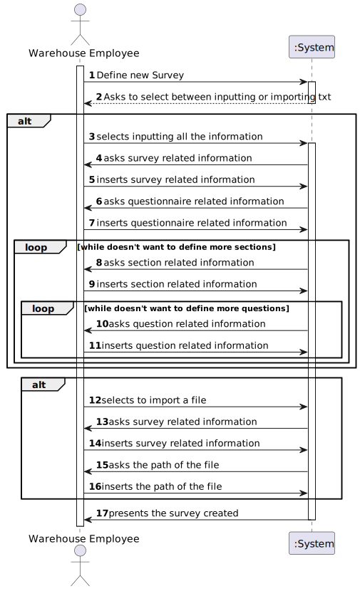
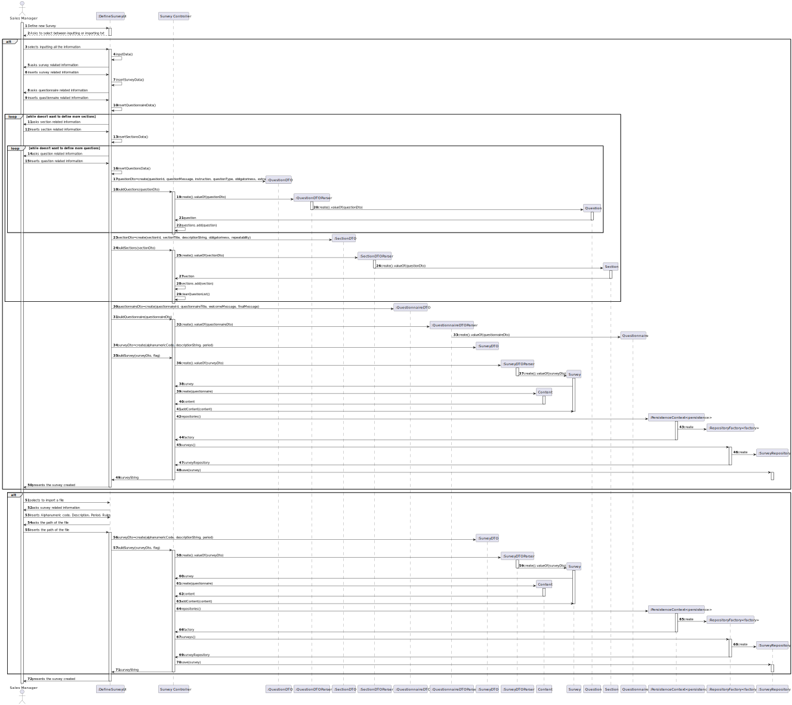
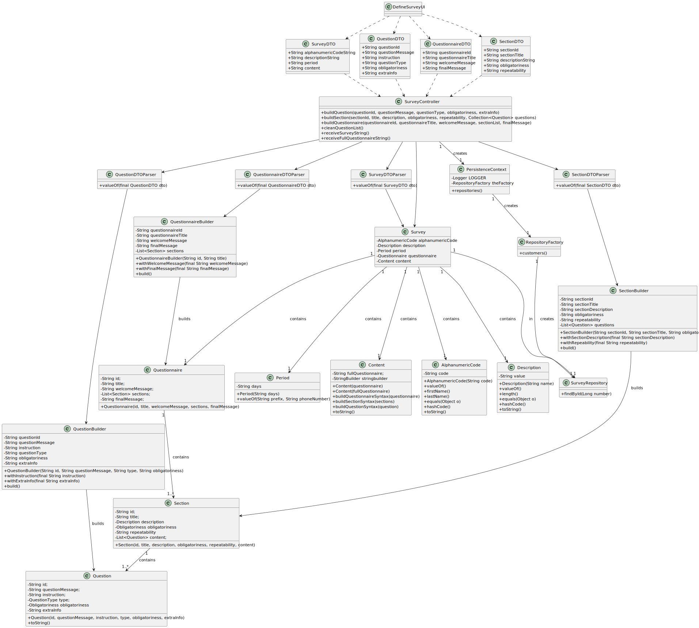

# US3001
=======================================

# 1. Requisitos

**US3001** As Sales Manager, I want to create a new questionnaire to be further answered by customers meeting the specified criteria (e.g.: have ordered a given product; belong to a given age group).

A interpretação feita deste requisito foi no sentido de criar um questionário (txt ou pela aplicação), este questionário estará associado a uma população alvo. (Pertence a um certo grupo etário, ter pedido um certo produto etc.).

# 2. Análise

## 2.1 Sequência das ações

* O sistema irá perguntar para introduzir os elementos constituintes de um questionário ou caso o questionário esteja num txt,
irá ser pedido apenas .

## 2.2 Pré Condições

Ter customers presentes no sistema, que fazem orders (para se tornarem numa população alvo).

## 2.3 Pós Condições

Validar o questionário usando uma gramática (US3000).
Enviar notificações aos clientes de quando têm questionários disponíveis para responderem.
Responder aos questionários.
Consultar respostas dos questionários.

## 2.4 Perguntas ao cliente

### 2.4.1 US3001 - Section
Q1: When a Section has a Question tagged as "Mandatory" should the section become "Mandatory" as well?
Q2: Can you specify what you mean when a Question/Section is tagged with "condition dependent" and the type of conditions to be set.

([Link](https://moodle.isep.ipp.pt/mod/forum/discuss.php?d=16388))

### 2.4.2 US3001
I have some doubts about the questionnaires.

Q1: The same section can be present in more than one questionnaire?
Q2: The same question can be present in more than one section?

A:
Yes, that can happen.

However, there is no intend to reutilize questions and/or sections. If that happens, the user will type the question/section again.

([Link](https://moodle.isep.ipp.pt/mod/forum/discuss.php?d=16401#p21104))

### 2.4.3 US3001

Dear client,

In the document, we have "Repeatability - Optional condition stating if the questions of this section are to be answered more than once. At least two kinds of conditions need to be supported: (i) based on numeric answers or (ii) on a set of selected values."

Q: Could you better specify what you mean by "repeatability"? Maybe give an example of how you wanted it to work in a user perspective. (Do you have to answer each question X amount of times / the section repeats itself X times).

Q: Is this "repeatability" attribute just repeating the same question to the customer?  Or does something change?

A:
Please, check the example presented on section 5.1.3 of the specifications' document.

In particular, consider the last sentence regarding section 6.

([Link](https://moodle.isep.ipp.pt/mod/forum/discuss.php?d=16391))

### 2.4.4 Answers of Surveys

Q:
Dear Client,

Do the answers of surveys need to be linked to the user that answered the specific survey, is it anonymous or does it not matter?

Best regards, 2DK_G04

A:

While specifying a survey (US3001) the need (or not) to preserve a link to the user answering the questionnaire is defined.

Some surveys will be answered anonymously (not having a link to the user) while other might be answered identifying the users.

In either cases, the system must know if a user has (or not) already answered a given questionnaire.

([Link](https://moodle.isep.ipp.pt/mod/forum/discuss.php?d=15806))

### 2.4.5 US3001 - Questionnaires, Sections and Questions

Q: Can you specify / define what business rules are associated to Questionnaire, Section and Question? (Eg: Questionnaire ID only has 9 characters / follows an expression).

Basic business rules related with Questionnaire, Section and Question are already available on the specifications document, namely on Table 1, 2 and 3.

Teams must adopt common-sense when applying other criteria such as min/max chars length and support/explain the rationale taken.

([Link](https://moodle.isep.ipp.pt/mod/forum/discuss.php?d=16387))

### 2.4.6 US3001 - Questionnaires, Sections and Questions

Q: Can you specify / define what business rules are associated to Questionnaire, Section and Question? (Eg: Questionnaire ID only has 9 characters / follows an expression).

Basic business rules related with Questionnaire, Section and Question are already available on the specifications document, namely on Table 1, 2 and 3.

Teams must adopt common-sense when applying other criteria such as min/max chars length and support/explain the rationale taken.

([Link](https://moodle.isep.ipp.pt/mod/forum/discuss.php?d=16387))

Q:
Dear Client,

Do the answers of surveys need to be linked to the user that answered the specific survey, is it anonymous or does it not matter?

Best regards, 2DK_G04

A:

While specifying a survey (US3001) the need (or not) to preserve a link to the user answering the questionnaire is defined.

Some surveys will be answered anonymously (not having a link to the user) while other might be answered identifying the users.

In either cases, the system must know if a user has (or not) already answered a given questionnaire.

([Link](https://moodle.isep.ipp.pt/mod/forum/discuss.php?d=15806))

### 2.4.7 US3001 - Section

Q1: When a Section has a Question tagged as "Mandatory" should the section become "Mandatory" as well?
Q2: Can you specify what you mean when a Question/Section is tagged with "condition dependent" and the type of conditions to be set.

Answers:

Answering (starting from the last question):

Q2: If the "obligatoriness" of a question/section is "condition dependent", it means it is "mandatory" when the associated condition evaluates as "true" and it is "optional" otherwise.

Q1: The question/answer is not straightforward. However, some consistency/coherence must exist/be assured between the "obligatoriness" of the section and of the question. You must also assure consistency with the "repeatability" information of the section.

Please, check carefully the example provided on section 5.1.3 of the specifications document where you can find "mandatory" sections (e.g.: section 1), "optional" sections (e.g.: section 8) and "condition dependent" sections (e.g.: section 3, 4 and 5). You can also find  "repeatable" sections (e.g.: section 6).

A "mandatory" or "condition dependant" section does not imply any "obligatoriness" on the questions.

An "optional" section implies that all questions are also "optional".

If a question is "mandatory", it means the user needs to answer such question no matter what is stated at the section it appears on.

If a question is "optional", it means that is up to the user to answer or not the question no matter what is stated at the section it appears on.

If a question is "condition dependent", it means the system needs to evaluate the associated condition to determine how to proceed, i.e. as "mandatory" or as "optional" question.

([Link](https://moodle.isep.ipp.pt/mod/forum/discuss.php?d=16388#p21044))

## 2.5 SSD

# 3. Design

## 3.1. Realização da Funcionalidade

## 3.2. Diagrama de Classes

## 3.3. Padrões Aplicados

## 3.4. Testes 

# 4. Implementação

# 5. Integração/Demonstração

- Foi adicionada uma opção (Questionnaire -> Set up new Questionnaire) ao menu do Sales Manager.

# 6. Observações

