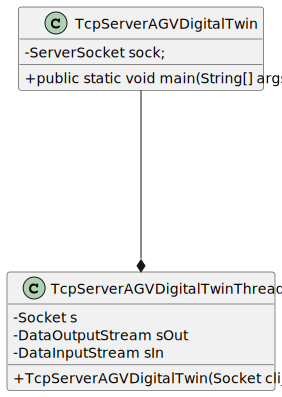

# US5002
=======================================

# 1. Requisitos

**US5002** As Project Manager, I want that the team start developing the output communication module of the AGV digital twin to update its status on the "AGVManager".

A interpretação feita deste requisito foi no sentido de criar server, client usando TCP, que consiga dar update ao status do AGVManager, no caso desta US será apenas o output.

# 2. Análise

Vai ser necessário criar a classe AGV digital Twin, que ainda não existe no nosso projeto.

## 2.1 Sequência das ações

* Não há ações, o programa ir correr paralelamente.

## 2.2 Pré Condições

Ter o server cliente, que manda pedidos ao server (desenvolvido nesta US).

## 2.3 Pós Condições

Server cliente receber as mensagens.

## 2.4 Perguntas ao cliente

### 2.4.1 USs 1901/4001/5001/5002
Q:
Dear Client
Regarding the USs 1901,4001, 5001, and 5002, what would you consider its complete state, that is, what would be the criterion to define whether or not this US is functional?
Best Regards

A:

For all of those US, the communication between the two involved components must be implemented in accordance with the SPOMS2022. The requests processing can be somehow mocked. For instance, if processing a request implies saving some data to the database, the component can instead write such data to a log (mocking). Latter, on next sprint, the teams implement the interaction to the database.
However, it is not advisable mocking everything, namely the components (internal) state. Notice that by mocking you are letting extra effort to the next sprint.
Finally, all US must be demonstrable.

([Link](https://moodle.isep.ipp.pt/mod/forum/view.php?id=93680))

### 2.4.2 US5001, US5002
Q:
Dear Client,
I have a question about the input and output communication between the AGV DIgital Twin and the AGV Manager.
Q: What type of communication do you want, i.e., what are the communications that you want to have between these two. Like AGV Manager says "Take a product" and AGV Digital Twin says "Taken"? Is it something like that? Or am i confused?

A:
The communication must follow the SPOMS2022 protocol.
It is up to you and your team to devise a set of messages fulfilling the business requirements properly.

([Link](https://moodle.isep.ipp.pt/mod/forum/discuss.php?d=16593))

## 2.5 SSD

Não possui.

# 3. Design

## 3.1. Realização da Funcionalidade

Não possui.

## 3.2. Diagrama de Classes

## 3.3. Padrões Aplicados

## 3.4. Testes 

# 4. Implementação

# 5. Integração/Demonstração

# 6. Observações

